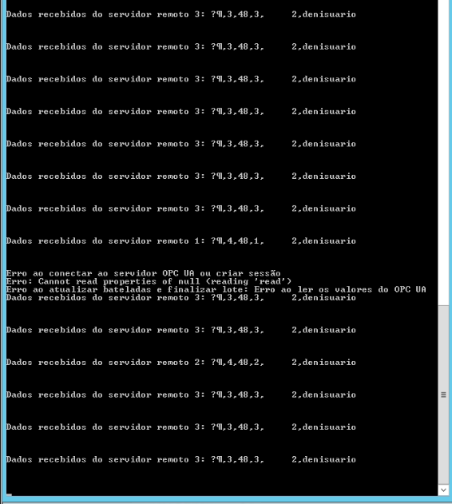

# Pontos de atenção

[] Se o operador não selecionar o Lote e iniciar a pesagem...a api armazena as bateladas vinculando com o último lote "configurado'?

[] Zerar os valores do LOTE sempre que for iniciar o processo, e não enviar o processo quando não houver lote selecionado?

[] Algumas vezes foi enviado um lote zerado para API(O que ocasiona um erro). Confirmar e não enviar dados, quando a opção salvar dados estiver ativas, mas lote com valor 0.

# Protocolo - Envio de parametros

    * Os testes foram feitos sempre utilizando 2 ou 3 balanças, no modo de sincronimosmo.

[] Não Enviou o status 1, para lote iniciado

[] Não enviou status 2, para lote em aberto

[] Confirmar o que é o envio do parametro 5 - tratar na API.

[] Sempre envia o Status 3, mesmo com o lote ainda em andamento, o que finaliza o lote no banco.( continua atualizando, mas finaliza)

[] Depois de um tempo parado, começa a enviar o parametro 5

[] Envias Varias vezes oa parametro 3. (verificar a frenquecia dos envios.)

[] Deu erro na comunicação com OPC UA e foi necessário reiniciar a API para voltar os envios.

[] Se alterar o peso do lote na smartServer durate o fluxo, o que acontece?

